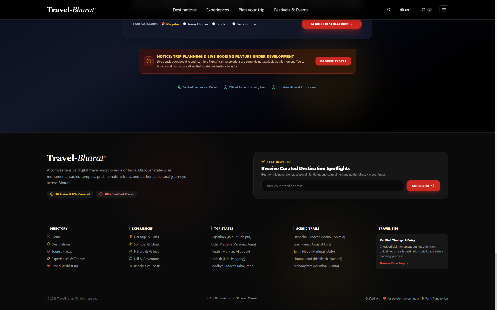
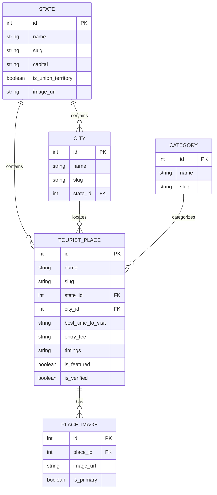

<div align="center">


# TravelBharat — Digital Tourism Encyclopedia of India

**A centralized, state-wise, and city-wise tourist destination discovery platform.**  
_Unified Mentor Internship Project • Built with Django, PostgreSQL, React (Vite) & Tailwind CSS_

---

[](https://www.djangoproject.com/)
[](https://www.django-rest-framework.org/)
[](https://www.postgresql.org/)
[](https://reactjs.org/)
[](https://vitejs.dev/)
[](https://tailwindcss.com/)

</div>

---

## 📌 Table of Contents

1. [Project Overview](#-project-overview)
2. [Visual Showcase & Gallery](#-visual-showcase--gallery)
3. [Key Features](#-key-features)
4. [Tech Stack](#-tech-stack)
5. [Database Architecture & Schema](#-database-architecture--schema)
6. [API Endpoints Reference](#-api-endpoints-reference)
7. [Installation & Setup Guide](#-installation--setup-guide)
8. [Project Structure](#-project-structure)
9. [Author & Credits](#-author--credits)

---

## 📖 Project Overview

**TravelBharat** is a comprehensive, production-grade tourism discovery web platform that organizes India's rich cultural heritage, sacred spiritual sites, pristine natural landscapes, and thrill hubs across all **36 States & Union Territories**.

### 🎯 Scope & Objectives

- **Hierarchical Discovery**: Navigate seamlessly from Geographic Regions ➔ States & UTs ➔ Cities ➔ Verified Tourist Destinations.
- **Rich Verified Destination Profiles**: Comprehensive historical background, best visiting months, entry fees, visiting hours, Google Maps directions, and image galleries.
- **Search & Multi-Filter Engine**: Filter destinations simultaneously across states, cities, and categories (Heritage, Spiritual, Nature, Wildlife, Adventure, Beach, Culture).
- **Personalized Bucket List**: Save and manage favorite destinations locally with instant slide-over drawer access.
- **Centralized Admin Moderation Panel**: Content moderation interface for reviewing, verifying, featuring, and creating tourist destinations.

---

## 📸 Visual Showcase & Gallery

### 🏠 1. Landing & Home Page Experience

Experience India through an interactive auto-rotating Hero slider, curated live attractions, thematic travel diaries, an interactive 3D spotlight carousel of lesser-known wonders, and an itinerary planner widget.

|                            Hero & Top Highlights                            |                             Popular Live Attractions                              |
| :-------------------------------------------------------------------------: | :-------------------------------------------------------------------------------: |
|  |  |

|                              Thematic Travel Diaries                               |                                Lesser-Known Wonders 3D Carousel                                |
| :--------------------------------------------------------------------------------: | :--------------------------------------------------------------------------------------------: |
|  |  |

<div align="center">
  <p><strong>Trip Planner & Transit Notice Widget</strong></p>
  
</div>

---

### 🔍 2. Navigation, Search & Wishlist Drawers

Features instant trending search popovers, a persistent Wishlist Drawer, and a full-height Slide-over Navigation Drawer with auto-scroll section jumps.

|                              Instant Search Popover                              |                                 Saved Wishlist Bucket List                                 |                                 Slide-Over Navigation Drawer                                 |
| :------------------------------------------------------------------------------: | :----------------------------------------------------------------------------------------: | :------------------------------------------------------------------------------------------: |
|  |  |  |

---

### 🗺️ 3. Regional Directories & Destination Exploration

Browse destinations by geographic regions with clean regional map illustrations across States & UTs, Major Cities, and Wildlife National Parks.

|                                36 States & Union Territories                                 |                                     Destination Cities by Region                                     |                                    Wildlife National Parks                                     |
| :------------------------------------------------------------------------------------------: | :--------------------------------------------------------------------------------------------------: | :--------------------------------------------------------------------------------------------: |
|  |  |  |

<div align="center">
  <p><strong>Filterable Destinations Directory (180+ Tourist Places)</strong></p>
  
</div>

---

### 🏛️ 4. State, City & Place Detail Pages

Deep-dive into specific regions and monuments with historical background, entry fees, timings, weather guides, nearby spots, and interactive Google Map embeds.

|                           State Profile (e.g. Maharashtra)                           |                          City Profile (e.g. Mumbai)                           |
| :----------------------------------------------------------------------------------: | :---------------------------------------------------------------------------: |
|  |  |

<div align="center">
  <p><strong>Place Detail Profile (e.g. Gateway of India, Mumbai)</strong></p>
  
</div>

---

### 🛡️ 5. Centralized Admin Moderation Panel

A custom, secure admin dashboard allowing staff administrators to search, verify, feature, add, and moderate destination listings with real-time statistics.

<div align="center">
  
</div>

---

### 🌐 6. Cohesive Public Footer

Clean brand footer featuring directory links, thematic exploration categories, top state routes, and an interactive newsletter subscription box.

<div align="center">
  
</div>

---

## ⚡ Key Features

- **State & City Hierarchy**: Complete coverage of 36 States & UTs, 50+ major tourism cities, and 180+ destination entries.
- **7 Experience Categories**: Heritage & Forts, Spiritual & Ghats, Nature & Hills, Wildlife Safaris, Coastal Beaches, Thrill Adventure, and Living Culture.
- **Dynamic Live Search & Filter**: Real-time multi-parameter filtering by search keyword, state, and category.
- **Offline-Ready Wishlist**: Save places to a personal bucket list stored locally in `localStorage` with zero latency.
- **Responsive & Modern UI**: Built with Tailwind CSS, custom fonts, dark-mode styling, glassmorphism, and smooth scroll restoration.
- **Dual Admin System**: Standard Django Admin panel at `/admin/` plus a dedicated React Admin Moderation Dashboard at `/admin/dashboard`.
- **Pre-Seeded Database**: Automated management commands to seed all 36 Indian states, regional cities, categories, places, and Unsplash imagery.

---

## 🛠️ Tech Stack

### Frontend

- **Framework**: React 18 (Vite)
- **Styling**: Tailwind CSS (v4)
- **Icons**: Lucide React
- **Routing**: React Router DOM (v6) with custom `ScrollToTop` restoration
- **HTTP Client**: Axios

### Backend

- **Framework**: Django 5.1+
- **API Engine**: Django REST Framework (DRF)
- **CORS**: `django-cors-headers`
- **Database**: PostgreSQL 16
- **Image Processing**: Pillow
- **Environment**: `python-dotenv`

---

## 🗄️ Database Architecture & Schema



---

## 🔌 API Endpoints Reference

**Base URL**: `http://127.0.0.1:8000/api/`

| HTTP Method | Endpoint                            | Description                                                                  |
| ----------- | ----------------------------------- | ---------------------------------------------------------------------------- |
| `GET`       | `/api/states/`                      | List all 36 States & UTs with destination counts                             |
| `GET`       | `/api/states/{slug}/`               | Retrieve state profile with associated cities                                |
| `GET`       | `/api/states/{slug}/places/`        | Retrieve verified places within a state                                      |
| `GET`       | `/api/cities/`                      | List all cities (filterable by `?state=slug`)                                |
| `GET`       | `/api/categories/`                  | List all 7 tourism experience categories                                     |
| `GET`       | `/api/places/`                      | List places (supports `?search=`, `?state=`, `?category=`, `?featured=true`) |
| `GET`       | `/api/places/{slug}/`               | Retrieve full place details, timings, fees, and images                       |
| `GET`       | `/api/places/featured/`             | Retrieve curated featured attractions for home hero                          |
| `GET`       | `/api/places/stats/`                | Retrieve system analytics (verified counts, totals)                          |
| `POST`      | `/api/admin/login/`                 | Authenticate staff/superuser credentials for moderation                      |
| `POST`      | `/api/places/`                      | Create a new tourist destination listing (Admin)                             |
| `POST`      | `/api/places/{slug}/toggle_verify/` | Toggle verified destination status (Admin)                                   |
| `DELETE`    | `/api/places/{slug}/`               | Delete a destination listing (Admin)                                         |

---

## 🚀 Installation & Setup Guide

### Prerequisites

- **Python 3.11+** installed
- **Node.js 18+** & npm installed
- **PostgreSQL 14+** installed and running

---

### Step 1: Clone & Configure Environment

```bash
git clone https://github.com/your-username/TravelBharat.git
cd TravelBharat
```

Create `.env` file in the project root:

```ini
DJANGO_SECRET_KEY=your-secure-secret-key-here
DJANGO_DEBUG=True
DJANGO_ALLOWED_HOSTS=localhost,127.0.0.1

DB_NAME=travelbharat
DB_USER=postgres
DB_PASSWORD=your_postgres_password
DB_HOST=localhost
DB_PORT=5432

CORS_ALLOWED_ORIGINS=http://localhost:5173,http://127.0.0.1:5173
```

---

### Step 2: Backend Setup (Django + PostgreSQL)

1. Create a Python Virtual Environment:

```powershell
python -m venv venv
.\venv\Scripts\Activate.ps1
```

2. Install Python Dependencies:

```powershell
pip install -r requirements.txt
```

3. Create the PostgreSQL Database:

```sql
CREATE DATABASE travelbharat;
```

4. Run Database Migrations:

```powershell
cd backend
python manage.py migrate
```

5. Seed Initial Data (36 States, Cities, Categories & Places):

```powershell
python manage.py seed_sample_data
```

6. Create Superuser (Admin Access):

```powershell
python manage.py createsuperuser
```

7. Start Django Server:

```powershell
python manage.py runserver
```

Backend API will be live at `http://127.0.0.1:8000/api/`  
Django Admin Panel at `http://127.0.0.1:8000/admin/`

---

### Step 3: Frontend Setup (React + Vite + Tailwind)

1. Open a new terminal and navigate to `frontend`:

```powershell
cd frontend
npm install
```

2. Start the Frontend Development Server:

```powershell
npm run dev
```

3. Open your browser and navigate to:

```
http://localhost:5173/
```

---

## 📁 Project Structure

```
TravelBharat/
├── backend/                              # Django Backend
│   ├── config/                           # Project Configuration & Settings
│   │   ├── settings.py                   # App config, database, CORS, DRF
│   │   ├── urls.py                       # Root URL router
│   │   └── wsgi.py
│   ├── destinations/                     # Main Tourism App
│   │   ├── management/commands/          # Database Seed Commands (36 States)
│   │   │   ├── seed_data/                # Regional Data Python Modules
│   │   │   └── seed_sample_data.py
│   │   ├── models.py                     # State, City, Category, TouristPlace, PlaceImage
│   │   ├── serializers.py                # DRF Serializers (Read & Write)
│   │   ├── views.py                      # ViewSets & Custom Actions
│   │   ├── urls.py                       # API URL Routes
│   │   └── admin.py                      # Django Admin Model Registrations
│   └── manage.py
├── frontend/                             # React 18 + Vite Frontend
│   ├── public/                           # Static public icons & favicon
│   ├── src/
│   │   ├── assets/                       # Brand icons
│   │   ├── Destinations-Images/          # Regional Map Visuals (North, South, East, West, Central, North-East)
│   │   ├── components/                   # Reusable UI Components
│   │   │   ├── Navbar.jsx                # Header & Portal Navigation Drawer
│   │   │   ├── Footer.jsx                # Brand Public Directory Footer
│   │   │   ├── FavoritesDrawer.jsx       # Wishlist Bucket List Drawer
│   │   │   ├── ScrollToTop.jsx           # Global Route Scroll Restoration
│   │   │   ├── SearchFilterBar.jsx       # Destination Search & Filter Engine
│   │   │   └── TouristCard.jsx           # Responsive Destination Card
│   │   ├── context/                      # State Management
│   │   │   └── FavoritesContext.jsx      # Wishlist Provider with LocalStorage
│   │   ├── pages/                        # Views & Routes
│   │   │   ├── Home.jsx                  # Hero, Attractions, Diaries, Wonders 3D, Planner
│   │   │   ├── States.jsx                # Regional Directory (States, Cities, Parks)
│   │   │   ├── Places.jsx                # All 180+ Places Filter Directory
│   │   │   ├── StateDetail.jsx           # State Profile & Cities Explorer
│   │   │   ├── CityDetail.jsx            # City Profile & Sights
│   │   │   ├── PlaceDetail.jsx           # Destination Details, Timings, Fees, Maps
│   │   │   ├── Categories.jsx            # 7 Thematic Category Explorations
│   │   │   └── admin/                    # Dedicated Admin Moderation Panel
│   │   │       ├── AdminLogin.jsx        # Secure Admin Authentication
│   │   │       └── AdminDashboard.jsx    # Live Moderation, Verification & Stats
│   │   ├── services/                     # Axios API & Data Helpers
│   │   │   ├── api.js                    # API Client & Endpoints
│   │   │   ├── stateData.js              # State Descriptions & Guides
│   │   │   ├── cityData.js               # City Guides & Highlights
│   │   │   └── placeData.js              # Fallback Place Metadata
│   │   ├── App.jsx                       # Routing & App Layout
│   │   ├── index.css                     # Tailwind CSS Custom Config
│   │   └── main.jsx                      # Entrypoint
│   ├── index.html
│   ├── package.json
│   └── vite.config.js
├── screenshots/                          # Full Project Showcase Screenshots
├── requirements.txt                      # Python Backend Dependencies
├── .env.example                          # Environment Variables Template
└── README.md                             # Project Documentation
```

---

## 👨‍💻 Author & Credits

- **Developer**: Parth Pungaonkar
- **Project**: Unified Mentor Internship Program

---

<div align="center">
  <sub>Built with ❤️ for Unified Mentor Internship - Parth Pungaonkar</sub>
</div>
